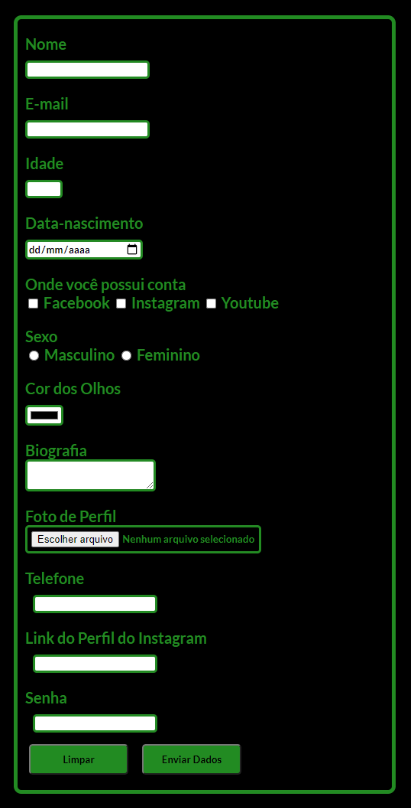

# Meu primeiro projeto - Formulário

> Primeiro projeto feito 100% por mim um modelo de formulário básico feito com o HTML e CSS.

### Ajustes e melhorias

O projeto ainda está em desenvolvimento e as próximas atualizações serão voltadas nas seguintes tarefas:

- [X] Estrutura HTML
- [X] Estilização CSS
- [X] Linkar E-mail de envio do formulário  

## 🤝 Colaboradores

Agradecemos às seguintes pessoas que contribuíram para este projeto:

<table>
  <tr>
    <td align="center">
      <a href="#">
         
        
          <b>Gustavo Mendes </b>
        
      </a>
    </td>
  
</table>

